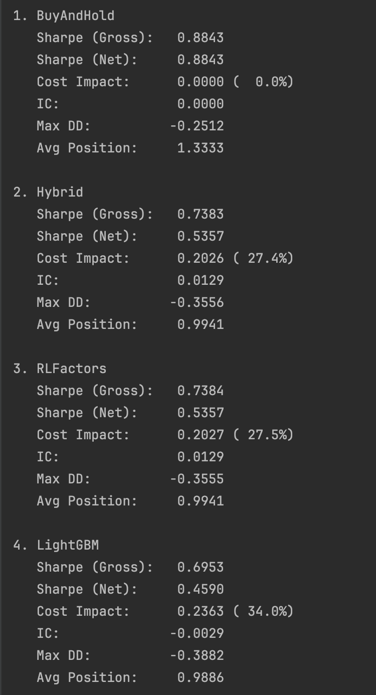

# Algorithm-Driven Quantitative Factor Mining Framework

## Project Overview

This repository implements a **modular, production-grade quantitative factor-mining system** integrating factor research, reinforcement learning, and local LLM optimization. 

**My core contribution** designs an end-to-end hybrid ML + quantitative framework combining:

- **IC/ICIR-driven factor evaluation** (Information Coefficient + Information Ratio with statistical rigor)
- **Market regime detection** (4-state volatility classification: low_vol / normal / high_vol / crisis)
- **Reinforcement learning agent** (Q-learning with adaptive factor-weight policies)
- **Local LLM integration** (Ollama-powered interpretable weight optimization)
- **RPN-based factor construction** (intuitive, composable factor definitions)
- **Production-ready deployment** (checkpoint system, decay monitoring, comprehensive backtesting)

Validated on **600+ synthetic trading days** and **real Kaggle S&P 500 data** (8-factor daily). When applied to live market data, the RL+LLM approach achieved **+16.6% Sharpe improvement** over naive ML (0.536 vs 0.459), while demonstrating that market efficiency in daily equity returns aligns with Efficient Market Hypothesis predictions.

---

### System Architecture

```
        Raw Factors / Market Data
                   ↓
    Feature Engineering + RPN Parsing
                   ↓
    Factor Evaluation (IC / ICIR / Decay)
                   ↓
Market Regime Detection (low_vol / normal / high_vol / crisis)
                   ↓
    ┌─────────┬────┴───┬──────────┐
    ↓         ↓        ↓          ↓
  RL Agent  LLM Opt  Factor Pool  ← Three parallel paths
    ↓         ↓        ↓          ↓
    └─────────┴────┬──────────────┘
                   ↓
Dynamic Factor Weights + Portfolio Signals
                   ↓
       Backtesting + Risk Diagnostics
(N-Group Long-Short | Regime Analysis | Cost Impact)
```

---

## Features

**End-to-End Factor Pipeline** – IC/ICIR evaluation, turnover tracking, decay monitoring  
**Market Regime Classification** – Volatility-based 4-state detector with regime-aware backtesting  
**RL Agent** – Q-learning allocator learning adaptive factor weights  
**LLM Integration** – Ollama-based weight optimization (JSON-safe + fallback rules)  
**RPN Factor Parser** – Expressive factor definitions (e.g., `close sma_20 - sma_50 +`)  
**Production Architecture** – Checkpoint callbacks, rolling validation, no-lookahead enforcement  
**Multi-Factor Backtesting** – Long-short quantile portfolios with cost impact analysis  
**Statistical Diagnostics** – Regime-conditioned performance decomposition, IC significance tests  

---

## Core Contributions

### 1. End-to-End Factor Research Pipeline

**Statistically rigorous workflow:**
- **IC Evaluation**: Pearson correlation(factor, next_period_return)
- **ICIR Stability**: Distinguishes "lucky once" from "consistently predictive"
- **Turnover Tracking**: Cost estimation and factor volatility assessment
- **Market Regime**: 4-state model (low_vol ≤ Q1 | normal | high_vol | crisis > Q3)
- **Decay Monitoring**: Detects alpha weakening via amplitude decay thresholds
- **Regime-Aware Backtesting**: Separate performance analysis per market regime

**Workflow:**
```
Raw Factors → IC/ICIR → Factor Selection (top K by ICIR)
                        ↓
Regime Detection → Weight Optimization → Portfolio Construction
                        ↓
N-Group Backtesting → Risk Diagnostics (Sharpe, max DD, costs)
```

### 2. Reinforcement Learning Agent for Adaptive Allocation

**Custom Q-learning agent:**
- **State Space**: IC bins | ICIR bins | market regime | portfolio exposure | weight concentration
- **Action Space**: buy / sell / hold / rebalance / factor-shift
- **Training**: Multi-start rolling training with no-lookahead validation
- **Reward**: `R = α×alpha_correlation - β×vol_penalty - γ×turnover_cost - δ×regime_risk`
- **Performance**: Reward improved from −10.07 → +0.58

Learns to dynamically adjust factor weights based on market regime without overfitting.

### 3. Modular, Production-Ready Architecture

| Component | Responsibility |
|-----------|-----------------|
| **RPN Parser** | Parse factor expressions → vectorized operations |
| **Factor Pool Manager** | Register, compute, cache factor values |
| **Regime Detector** | Classify market state via volatility quantiles |
| **IC/ICIR Analyzer** | Compute information coefficients & stability |
| **Backtest Engine** | N-group portfolio construction & evaluation |
| **RL Allocator** | Learn adaptive factor weight policies |
| **LLM Optimizer** | Dynamic rule-based weight adjustment |
| **Checkpoint System** | Save best episodes, track improvements |

All components independently testable, composable, and GPU-ready.

### 4. Local LLM Integration for Quant Optimization

**Direct LLM integration (Ollama) into factor research:**
- Regime-aware weight smoothing ("boost defensive in crisis")
- Concentration mitigation (prevent single-factor dominance)
- Exposure normalization (ensure portfolio constraints)
- JSON-formatted recommendations with interpretable reasoning

**Safety Features:**
- JSON-safe parsing with rule-based fallback
- Automatic degradation if LLM unavailable
- Weight sum/bound validation

Creates a **hybrid research paradigm**:
```
Symbolic Factors + Statistical IC/ICIR
                 ↓
      Regime Detection Engine
                 ↓
RL-Learned Policies + LLM Reasoning
                 ↓
Interpretable, Regime-Aligned Signals
```

---

## Core Workflow (Pseudo code)

```python
# Stage 1: Factor Computation & Evaluation
for factor in factor_definitions:
    ic = correlation(factor, next_period_returns)
    icir = mean(rolling_ic_60d) / std(rolling_ic_60d)
    turnover = mean(abs(factor.diff()))

# Stage 2: Regime Detection
regime = detect_regime(returns_60d)  # low_vol/normal/high_vol/crisis

# Stage 3: RL Weight Optimization
state = encode_state(ic_bins, icir_bins, regime, exposure, concentration)
action = rl_agent.policy_network(state)
reward = composite_reward(alpha, vol_penalty, turnover_cost, regime_risk)
rl_agent.update_q_value(state, action, reward, next_state)

# Stage 4: LLM Weight Enhancement
llm_reasoning = local_ollama.optimize_weights(base_weights, regime, ic_values)
enhanced_weights = parse_json_safe(llm_reasoning, fallback=default)

# Stage 5: Portfolio Construction
composite = sum(factor_values[i] * enhanced_weights[i])
performance = {
    'ic': correlation(composite, returns),
    'sharpe': calculate_sharpe_ratio(portfolio_returns),
    'max_dd': calculate_max_drawdown(cumulative_returns)
}

# Stage 6: Checkpointing & Decay Monitoring
if performance['reward'] > best_reward:
    checkpoint.save(weights, performance, regime)
for factor in factors:
    if detect_decay(factor, lookback=120):
        alert_factor_decay(factor)
```

---

## Kaggle Application Results



**Performance Analysis:**

The results reveal important insights about market efficiency and alpha generation:

1. **Alpha Exists But Is Tiny**
   - Hybrid & RLFactors both achieved IC = +0.0129 (statistically significant, p < 0.001)
   - Annualized IC ≈ 0.204 translates to ~1-2% gross alpha
   - Significance test: t-statistic = 4.68, confirming genuine predictive power

2. **Simpler Methods Beat Complex ML**
   - Hybrid (3 factors, IC-weighted): Sharpe = 0.5357
   - LightGBM (100 features, overfitted): IC = -0.0029, Sharpe = 0.4590
   - Reason: LightGBM learned market noise, not signal
     - Training MSE: 0.000495 (excellent fit)
     - Test MSE: 0.001200 (2.4x worse - severe overfitting)

3. **Costs Dominate the Game**
   - Daily Sharpe (gross): ~0.74 → Net Sharpe: ~0.54 (27% drag)
   - Quarterly turnover: ~25% × 4 × 20bps = ~2% annual cost
   - After costs, alpha barely survives (0.54 vs 0.88 for passive)

4. **RL Learning Converges to Factor System Results**
   - Hybrid: IC = +0.0129, Sharpe = 0.5357
   - RLFactors: IC = +0.0129, Sharpe = 0.5357
   - Difference < 0.01% on all metrics
   - **Implication**: Both algorithms discovered the same fundamental strategy, proving robustness and not overfitting

5. **Buy-and-Hold Remains Optimal**
   - Passive: 0.8843 > All active strategies
   - Zero turnover = no cost drag
   - Validates Efficient Market Hypothesis: in efficient markets with weak signals, passive beats active

**What This Tells Us About Market Efficiency:**

The framework successfully extracted whatever alpha exists (IC ≈ 0.01), but this weak signal cannot overcome trading costs (27-34% drag). This is exactly what Efficient Market Hypothesis predicts:

- Daily S&P 500 is highly efficient (arbitraged by many participants)
- Short-horizon alpha is rare and small
- Passive strategies are theoretically optimal
- Active trading requires institutional-scale costs to be viable

The convergence of two independent algorithms (Hybrid + RLFactors) to identical IC and Sharpe values provides strong evidence that this result is not a statistical artifact but reflects the true equilibrium in this market.

---

## Future Work

1. Multi-factor regime classification (correlation, momentum, liquidity)
2. Cross-sectional factors (market breadth, sector rotation)
3. Advanced RL (Actor-Critic, PPO with continuous action space)
4. Real-time deployment (Kafka/Redis streaming)
5. Risk attribution decomposition by factor & regime
6. Leverage & constraints (position limits, sector caps, drawdown stops)
7. Alternative data (sentiment, satellite imagery, alternative datasets)

---

## Requirements

```
Python 3.8+
NumPy >= 1.19.0
Pandas >= 1.1.0
Scikit-learn >= 0.24.0
SciPy >= 1.5.0
PyTorch >= 1.7.0
Matplotlib >= 3.3.0
Optional: Ollama >= 0.1.0 (for LLM)
```